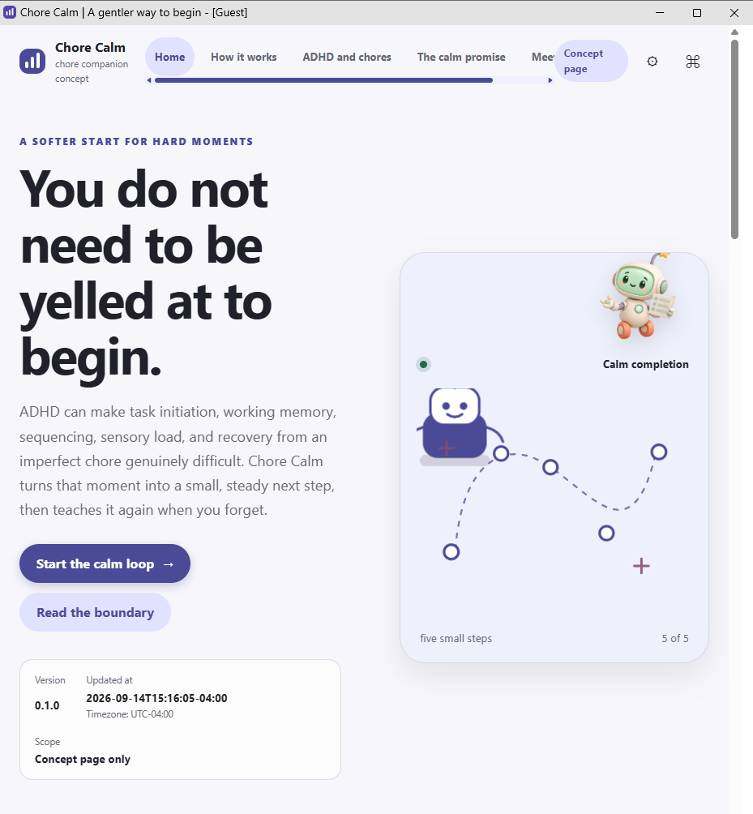
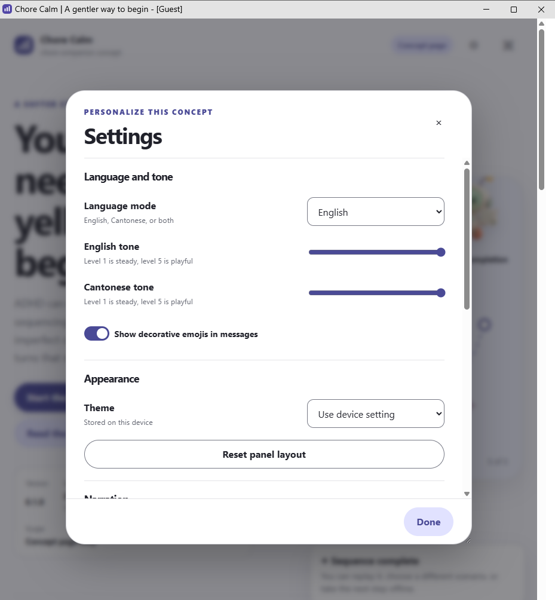
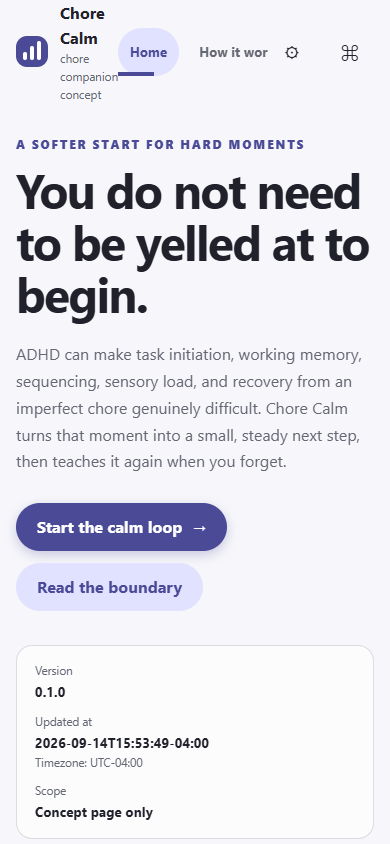

# Chore Calm

Chore Calm is a calm chore-companion concept. It is intended to teach routines, break work into
small steps, and remind without yelling, threats, shame, or language such as “I will move out
because of this.” There is no mess quota or annoyance ledger, and forgotten chores can be taught
again without turning a minor mess into a personal judgment.

## Concept scope

ADHD can make chores harder through initiation, working memory, sequencing, sensory load, and
recovery from mistakes. A calm companion can teach a routine, offer one next step, remind gently,
and help someone recover after a missed step. It cannot control another person's anger, predict
another person's reaction, or make a difficult home situation safe. It is not medical treatment,
does not diagnose ADHD, and does not replace professional, social, or emergency support.

廣東話講，ADHD 可以令家務難開始、難記住步驟、難安排次序、難承受感官負荷，做錯之後亦可能
難以重新整理再試。平靜嘅助手可以教你一個流程、一次提醒一小步，亦可以陪你由錯誤中復原。
但係，助手控制唔到另一個人會唔會發脾氣，亦唔係醫療治療，唔會取代專業支援。

## Build

The repository is dependency-free and offline-friendly. From a fresh Windows checkout, run:

```bat
.\build.bat --run
```

The command validates the repository contract, counts source lines, stages the root page, local
mascot assets, documentation, social preview, and commit-bound build provenance in `build\site`,
and opens the generated folder when `--run` is supplied. The local build is verified.
The same output includes the public crawler policy at `build\site\robots.txt`.

The installer route is documented for contract completeness, but an installer is not applicable
to this static documentation concept. See `build-installer.bat` for the honest no-installer result.

## Public landing page

Published URL, verified from the live response: [Chore Calm landing page](https://ding-ding-projects.github.io/chore-calm/).

The live response returned HTTP 200 from `main` after Pages deployment run `34888216195`.

## Marketing pages

- [How Chore Calm works](how-it-works.html): the five-step notice, break-down, coaching, recovery,
  and calm-completion story.
- [ADHD and chores](adhd-and-chores.html): a respectful explanation of task initiation, working
  memory, sequencing, sensory load, and recovery.
- [The calm promise](calm-promise.html): no yelling, no annoyance ledger, no mess quota, patient
  reteaching, and the honest boundary around other people's reactions.
- [Meet the chore companion](about-robot.html): the companion concept, local graphics, and product limits.
- [Crawler directives](docs/features/crawler-directives.md): the public `robots.txt` policy and build contract.

## Documentation

- [Documentation index](docs/README.md)
- [Chore coaching concept](docs/features/chore-coaching.md)
- [Universal feature coverage inventory](docs/coverage/universal-feature-coverage.md)
- [Roadmap](ROADMAP.md)
- [Handoff](HANDOFF.md)
- [Built page evidence](evidence/headless/20260914/README.md)

## Built page evidence

This repository includes inspected evidence from the isolated Lowlevel headless route, bound to
live revision `c43ae9a32f48cfec7c40fcccd3d5bdc9f1b8c524`. The captures show the real deployed page,
not a mock or design preview. The same revision carries the public `robots.txt` policy, page-level
search suppression metadata, and registered local Material Design 3 navigation, CTA, and form
primitives.

<details>
<summary>Open representative live captures</summary>







</details>

## Current evidence boundary

The integrated `main` candidate contains the public page, local mascot assets, product-specific
social preview, design handoff, build provenance, documentation, and Pages workflow. Local build,
strict source validation, remote Pages deployment, live HTML, provenance, preview-image fetch, and
listed built-page evidence are verified. Complete universal-surface evidence remains open.
